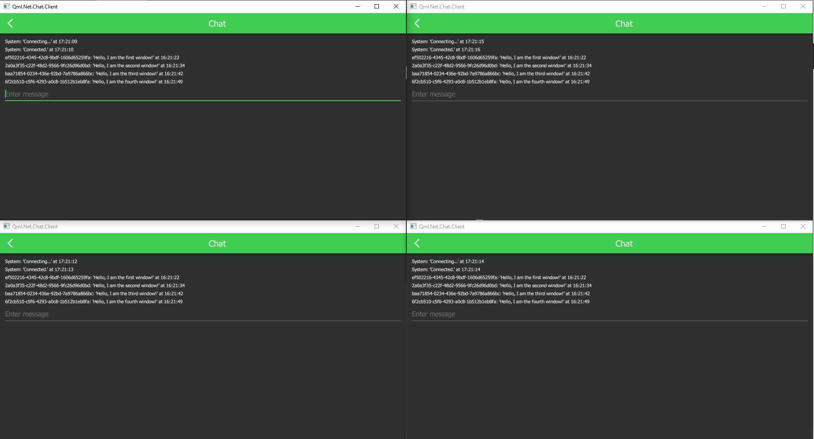

# Qml.Net.Chat

Containing client and server project. Communication with [ASP.NET Core SignalR](https://github.com/aspnet/AspNetCore/tree/master/src/SignalR), presentation with [Qml.Net](https://github.com/qmlnet/qmlnet).

## Running the app
1. Clone this repo
2. Run `run_server.bat`
3. Run `run_client.bat` (one or multiple times)

## Impression

